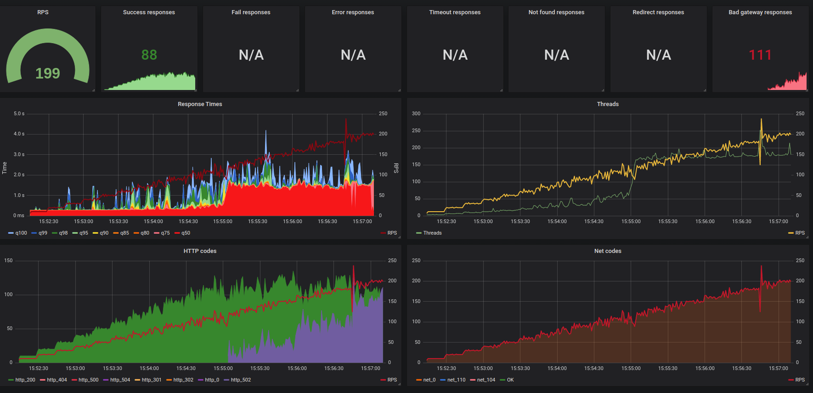

# Load testing stand

Stand for load testing with yandex tank and grafana dashboard

## Graph samples

Here is some sample graph.



## Installing / Getting started

```bash
git clone git@github.com:rmedvedev/load-testing-stand.git
cd load-testing-stand
./start.sh
```
After start, the grafana board will open in the default browser with monitoring of load testing

## Configuration

The project contains predefined settings in tests/config.yml

```yaml
phantom:
  # domain name or ip as target for load testing
  address: example.com
  # ammo file with requests
  ammofile: ammo.txt
  ammo_type: uri
  load_profile:
    load_type: rps
    schedule: step(5, 100, 5, 30)
  headers:
    - "[Host: example.com]"

# Uncomment this if you want to autostop load testing
# autostop:    
  # autostop: 
    # - http(5xx,25%,1s)  

console:
  enabled: true

influx:
  enabled: true
  address: influx
  database: metrics
  tank_tag: 'mytank'
```
tests/ammo.txt contains settings of requests of load testing. You can write your ammo.txt generator and add it to start.sh script

If you want to know about a more advanced configuration of Yandex tank use the [link](https://yandextank.readthedocs.io/en/latest/config_reference.html)
